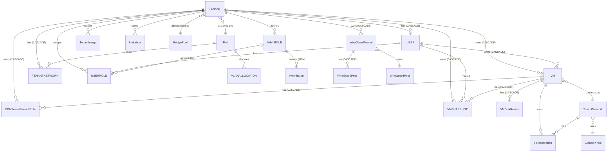

# Data Models Documentation

This document details the database schemas used by the Platform. These SQLAlchemy models define the structure for multi-tenant resource management.

---

## Table of Contents
- [User Model](#1-user-model)
- [Tenant Model](#2-tenant-model)
- [VM Model](#3-vm-model)
- [VMSnapshot Model](#4-vmsnapshot-model)
- [VMDiskResize Model](#5-vmdiskresize-model)
- [Network Models](#6-network-models)
- [OPNsense Firewall Rule Model](#7-opnsense-firewall-rule-model)
- [Firewall Provider Config Model](#8-firewall-provider-config-model)
- [IAM Models](#9-iam-models)
- [WireGuard Models](#10-wireguard-models)
- [Image Models](#11-image-models)
- [Bridge Pool Model](#12-bridge-pool-model)
- [Invitation Model](#13-invitation-model)
- [Audit Log Model](#14-audit-log-model)
- [IP Reservation Model](#15-ip-reservation-model)
- [Relationships](#16-relationships)

---

## 1. User Model

**Table Name:** `users`  
**Location:** `app/models/user.py`

The `User` model stores authentication credentials, user metadata, and tenant association.

### Schema Definition

| Field | Type | Constraints | Description |
| :--- | :--- | :--- | :--- |
| `id` | Integer | PK, Index | Unique identifier |
| `username` | String(50) | Unique, Index, Not Null | Username for login |
| `email` | String(100) | Unique, Index, Not Null | Email address |
| `hashed_password` | String(255) | Not Null | bcrypt hashed password |
| `full_name` | String(100) | Nullable | Display name |
| `is_active` | Boolean | Default: `True` | Account active status |
| `tenant_id` | Integer | FK (Nullable) | Primary tenant |
| `created_at` | DateTime(timezone=True) | Default: Now | Creation timestamp |
| `updated_at` | DateTime(timezone=True) | On Update: Now | Last modification |

### Key Logic

* **Password Security:** Uses SHA256 pre-hash + bcrypt (prevents 72-char truncation).
* **Soft Deletes:** Set `is_active = False` to disable without deleting.
* **Tenant Association:** Users belong to a primary tenant but can have roles in multiple tenants via `UserRole`.

---

## 2. Tenant Model

**Table Name:** `tenants`  
**Location:** `app/models/tenant.py`

The `Tenant` model represents an organization that owns resources (VMs, networks, users). Each tenant gets an OPNsense firewall VM.

### Schema Definition

| Field | Type | Constraints | Description |
| :--- | :--- | :--- | :--- |
| `id` | Integer | PK, Index | Unique identifier |
| `name` | String(100) | Unique, Not Null, Index | Organization name |
| `slug` | String(50) | Unique, Not Null, Index | URL-friendly identifier |
| `is_active` | Boolean | Default: `True` | Organization active |
| `is_verified` | Boolean | Default: `False`, Index | Admin verified |
| `status` | String | Default: `pending_approval` | Lifecycle status |
| `settings` | String | Default: `"{}"` | JSON quota settings |
| `bridge_id` | Integer | FK → `bridge_pool.bridge_id` (Nullable) | Allocated bridge |
| `pod_id` | Integer | FK → `pods.id` (Nullable) | Assigned pod |
| `opnsense_vm_id` | Integer | Nullable | OPNsense firewall VM ID |
| `opnsense_vm_name` | String | Nullable | OPNsense VM name |
| `lan_ip` | String | Nullable | LAN IP address |
| `wan_ip` | String | Nullable | WAN IP address |
| `wan_ip_last_changed_at` | DateTime(timezone=True) | Nullable | Last WAN IP change |
| `fixed_wan_ip` | String | Nullable | Static WAN IP |
| `fixed_wan_subnet` | Integer | Default: `24` | WAN subnet mask |
| `fixed_wan_gateway` | String | Nullable | WAN gateway |
| `wan_bridge` | String | Default: `vmbr0` | WAN bridge |
| `dhcp_pool_start` | String | Nullable | DHCP pool start |
| `dhcp_pool_end` | String | Nullable | DHCP pool end |
| `opnsense_api_key` | String | Nullable | OPNsense API key |
| `opnsense_api_secret` | String | Nullable | OPNsense API secret |
| `error` | String | Nullable | Last error message |
| `opnsense_interface_list` | String | Nullable | Cached interface list |
| `opnsense_interface_cached_at` | DateTime(timezone=True) | Nullable | Interface cache time |
| `provisioned_at` | DateTime(timezone=True) | Nullable | Provisioning timestamp |
| `created_at` | DateTime(timezone=True) | Default: Now | Creation timestamp |
| `updated_at` | DateTime(timezone=True) | On Update: Now | Last modification |

### Tenant Status Values

| Status | Description |
|--------|-------------|
| `pending` | Initial state |
| `pending_approval` | Awaiting admin approval |
| `verified` | Verified, awaiting provisioning |
| `provisioning` | Being provisioned |
| `active` | Fully operational |
| `suspended` | Temporarily suspended |
| `deprovisioned` | Deprovisioned |
| `error` | Provisioning failed |

---

## 3. VM Model

**Table Name:** `vms`  
**Location:** `app/models/vm.py`

The `VM` model stores virtual machine configurations and lifecycle state.

### Schema Definition

| Field | Type | Constraints | Description |
| :--- | :--- | :--- | :--- |
| `id` | Integer | PK, Index | Unique identifier |
| `name` | String | Unique, Index | VM name |
| `description` | String | Nullable | VM description |
| `provider` | String | Default: `proxmox`, Index | Virtualization provider |
| `image` | String | Nullable | VM image (deprecated) |
| `cpu` | Integer | Not Null | vCPU cores |
| `ram` | Integer | Not Null | Memory in MB |
| `disk_size_mb` | Integer | Default: 0 | Disk in MB |
| `ip_address` | String | Nullable | Assigned IP |
| `status` | String | Default: `pending`, Index | Lifecycle state |
| `terraform_job_id` | String | Nullable | Terraform reference |
| `celery_task_id` | String | Nullable | Celery task ID |
| `proxmox_vm_id` | Integer | Nullable | Proxmox VM ID |
| `template_id` | Integer | Nullable | Template ID |
| `error` | String | Nullable | Error message |
| `owner_id` | Integer | FK → `users.id` (CASCADE), Not Null | Owner user |
| `network_id` | Integer | FK → `tenant_networks.id` (SET NULL), Nullable | Network attachment |
| `tenant_id` | Integer | FK → `tenants.id` (CASCADE), Not Null | Tenant owner |
| `ssh_user` | String(64) | Default: `ubuntu` | SSH username |
| `ssh_public_key` | Text | Nullable | SSH public key |
| `ssh_private_key_enc` | Text | Nullable | Encrypted SSH private key |
| `created_at` | DateTime(timezone=True) | Default: Now | Creation timestamp |
| `updated_at` | DateTime(timezone=True) | On Update: Now | Last modification |

### Code Definition

```python
VALID_STATUS_TRANSITIONS = {
    "pending": ["creating", "provisioning", "running", "error"],
    "creating": ["pending", "provisioning", "error"],
    "provisioning": ["running", "error"],
    "running": ["stopped", "error"],
    "stopped": ["running", "error"],
    "error": ["pending", "stopped"]
}
```

### Status Lifecycle

| Status | Description |
|--------|-------------|
| `pending` | Initial state, queued for provisioning |
| `creating` | DB record created, task pending |
| `provisioning` | Actively creating infrastructure |
| `running` | Active and operational |
| `stopped` | Powered off |
| `error` | Operation failed |

---

## 4. VMSnapshot Model

**Table Name:** `vm_snapshots`  
**Location:** `app/models/vm.py`

The `VMSnapshot` model stores VM backup snapshots.

### Schema Definition

| Field | Type | Constraints | Description |
| :--- | :--- | :--- | :--- |
| `id` | Integer | PK, Index | Unique identifier |
| `vm_id` | Integer | FK → `vms.id` (CASCADE), Not Null, Index | Source VM |
| `name` | String | Not Null | Snapshot name |
| `description` | String | Nullable | Description |
| `image_tag` | String | Not Null | Storage tag |
| `container_config` | Text | Nullable | Config backup |
| `created_at` | DateTime(timezone=True) | Default: Now | Creation timestamp |
| `created_by` | Integer | FK → `users.id` (SET NULL), Nullable | Creator user |
| `tenant_id` | Integer | FK → `tenants.id` (CASCADE), Not Null, Index | Tenant owner |

---

## 5. VMDiskResize Model

**Table Name:** `vm_disk_resizes`  
**Location:** `app/models/vm.py`

Tracks disk resize operations for audit and deduplication.

### Schema Definition

| Field | Type | Constraints | Description |
| :--- | :--- | :--- | :--- |
| `id` | Integer | PK, Index | Unique identifier |
| `vm_id` | Integer | FK → `vms.id` (CASCADE), Not Null, Index | Source VM |
| `disk_id` | String(20) | Not Null | Disk identifier (e.g., "scsi0") |
| `previous_size_mib` | Integer | Not Null | Previous size in MiB |
| `new_size_mib` | Integer | Not Null | New size in MiB |
| `resized_by` | Integer | FK → `users.id` (SET NULL), Nullable | Resizing user |
| `created_at` | DateTime(timezone=True) | Default: Now | Resize timestamp |

---

## 6. Network Models

### Pod Model

**Table Name:** `pods`  
**Location:** `app/models/network.py`

| Field | Type | Constraints | Description |
| :--- | :--- | :--- | :--- |
| `id` | Integer | PK | Unique identifier |
| `name` | String | Unique, Not Null | Pod name |
| `provider_type` | String | Default: `proxmox` | Provider |
| `node_names` | String | Nullable | Comma-separated nodes |
| `max_tenants` | Integer | Default: 100 | Max tenants |
| `tenant_count` | Integer | Default: 0 | Current count |
| `status` | String | Default: `active` | Pod status |

### TenantNetwork Model

**Table Name:** `tenant_networks`  
**Location:** `app/models/network.py`

| Field | Type | Constraints | Description |
| :--- | :--- | :--- | :--- |
| `id` | Integer | PK | Unique identifier |
| `tenant_id` | Integer | FK → `tenants.id`, Not Null | Tenant owner |
| `pod_id` | Integer | FK → `pods.id`, Not Null | Hosting pod |
| `ip_pool_id` | Integer | FK → `global_ip_pool.id` (Nullable) | IP pool |
| `cidr` | String | Not Null | Network CIDR |
| `gateway_ip` | String | Not Null | Gateway IP |
| `vlan_id` | Integer | Nullable | VLAN ID (null = untagged) |
| `name` | String | Default: `default` | Network name |
| `is_default` | Boolean | Default: `False` | Default network |
| `status` | String | Default: `active` | Network status |
| `provider_ref` | String | Nullable | Provider reference |
| `opnsense_interface` | String | Nullable | OPNsense interface name |
| `created_at` | DateTime | Default: Now | Creation timestamp |

### GlobalIPPool Model

**Table Name:** `global_ip_pool`  
**Location:** `app/models/network.py`

| Field | Type | Constraints | Description |
| :--- | :--- | :--- | :--- |
| `id` | Integer | PK | Unique identifier |
| `cidr` | String | Unique, Not Null | Pool CIDR |
| `gateway_ip` | String | Not Null | Gateway IP |
| `pool` | String | Not Null | Pool identifier ("safe" or "overflow") |
| `status` | String | Default: `free` | Pool status |
| `tenant_network_id` | Integer | FK (Nullable) | Allocated network |
| `allocated_at` | DateTime | Nullable | Allocation timestamp |

### VlanAllocation Model

**Table Name:** `vlan_allocations`  
**Location:** `app/models/network.py`

| Field | Type | Constraints | Description |
| :--- | :--- | :--- | :--- |
| `id` | Integer | PK | Unique identifier |
| `pod_id` | Integer | FK → `pods.id`, Not Null | Pod reference |
| `vlan_id` | Integer | Not Null | VLAN ID (10-4094) |
| `status` | String | Default: `free` | Allocation status |
| `tenant_network_id` | Integer | FK (Nullable) | Allocated network |

**Constraints:** Unique on (`pod_id`, `vlan_id`)

---

## 7. OPNsense Firewall Rule Model

**Table Name:** `opnsense_firewall_rules`  
**Location:** `app/models/opnsense_firewall_rule.py`

| Field | Type | Constraints | Description |
| :--- | :--- | :--- | :--- |
| `id` | Integer | PK, Index | Unique identifier |
| `tenant_id` | Integer | FK → `tenants.id` (CASCADE), Not Null, Index | Tenant owner |
| `uuid` | String(36) | Unique, Not Null, Index | OPNsense rule UUID |
| `sequence` | Integer | Default: 100 | Rule ordering |
| `enabled` | String(1) | Default: `1` | Enabled state |
| `description` | String(500) | Nullable | Rule description |
| `interface` | String(20) | Nullable | Network interface |
| `interfacenot` | String(1) | Default: `0` | Interface negation |
| `quick` | String(1) | Default: `1` | Quick match |
| `action` | String(10) | Nullable | pass/block/reject |
| `direction` | String(3) | Nullable | in/out |
| `ipprotocol` | String(10) | Nullable | inet/inet6/inet46 |
| `protocol` | String(10) | Nullable | tcp/udp/icmp/any |
| `source_not` | String(1) | Default: `0` | Source negation |
| `source_net` | String(100) | Nullable | Source CIDR |
| `source_port` | String(50) | Nullable | Source port |
| `destination_not` | String(1) | Default: `0` | Destination negation |
| `destination_net` | String(100) | Nullable | Destination CIDR |
| `destination_port` | String(50) | Nullable | Destination port |
| `gateway` | String(50) | Nullable | Gateway routing |
| `log` | String(1) | Default: `0` | Log enabled |
| `statetype` | String(20) | Nullable | keep/sloppy/synproxy/none |
| `synced_at` | DateTime(timezone=True) | Nullable | Last sync time |
| `apply_status` | String(20) | Default: `synced` | Apply status |
| `apply_error` | String(500) | Nullable | Apply error message |
| `created_at` | DateTime(timezone=True) | Default: Now | Creation timestamp |
| `updated_at` | DateTime(timezone=True) | On Update: Now | Last modification |

---

## 8. Firewall Provider Config Model

**Table Name:** `firewall_provider_configs`  
**Location:** `app/models/firewall_provider_config.py`

| Field | Type | Constraints | Description |
| :--- | :--- | :--- | :--- |
| `id` | Integer | PK, Index | Unique identifier |
| `tenant_id` | Integer | FK → `tenants.id` (CASCADE), Not Null, Index | Tenant owner |
| `provider_type` | String(20) | Not Null, Index | Provider type |
| `vm_id` | Integer | Nullable | Firewall VM ID |
| `api_key` | String(255) | Nullable | API key |
| `api_secret` | String(255) | Nullable | API secret |
| `base_url` | String(255) | Nullable | API base URL |
| `is_active` | String(1) | Default: `0` | Active flag |
| `created_at` | DateTime(timezone=True) | Default: Now | Creation timestamp |
| `updated_at` | DateTime(timezone=True) | On Update: Now | Last modification |

---

## 9. IAM Models

### Permission Model

**Table Name:** `permissions`  
**Location:** `app/models/iam.py`

| Field | Type | Constraints | Description |
| :--- | :--- | :--- | :--- |
| `id` | Integer | PK, Index | Unique identifier |
| `name` | String(100) | Unique, Index, Not Null | Permission name (e.g., `vm:create`) |
| `resource_type` | String(50) | Not Null, Index | Resource type (e.g., `vm`) |
| `action` | String(50) | Not Null | Action (e.g., `create`) |
| `description` | String(255) | Nullable | Description |

**Constraints:** Unique on (`resource_type`, `action`)

### Role Model

**Table Name:** `iam_roles`  
**Location:** `app/models/iam.py`

| Field | Type | Constraints | Description |
| :--- | :--- | :--- | :--- |
| `id` | Integer | PK, Index | Unique identifier |
| `name` | String(50) | Not Null, Index | Role name |
| `description` | String(255) | Nullable | Description |
| `tenant_id` | Integer | FK → `tenants.id` (CASCADE), Nullable, Index | Tenant scope (null = system) |
| `is_preset` | Boolean | Default: `False` | Preset role |
| `is_system` | Boolean | Default: `False` | System role |
| `created_at` | DateTime(timezone=True) | Default: Now | Creation timestamp |
| `updated_at` | DateTime(timezone=True) | On Update: Now | Last modification |

**Constraints:** Unique on (`name`, `tenant_id`)

### UserRole Model

**Table Name:** `user_roles`  
**Location:** `app/models/iam.py`

| Field | Type | Constraints | Description |
| :--- | :--- | :--- | :--- |
| `id` | Integer | PK, Index | Unique identifier |
| `user_id` | Integer | FK → `users.id` (CASCADE), Not Null, Index | User reference |
| `tenant_id` | Integer | FK → `tenants.id` (CASCADE), Nullable, Index | Tenant scope |
| `role_id` | Integer | FK → `iam_roles.id` (CASCADE), Not Null, Index | Role reference |
| `granted_by` | Integer | FK → `users.id` (SET NULL), Nullable | Granted by user |
| `created_at` | DateTime(timezone=True) | Default: Now | Assignment timestamp |

**Constraints:** Unique on (`user_id`, `tenant_id`, `role_id`)

### Permission Strings

| Resource | Permissions |
|----------|------------|
| **VM** | `vm:create`, `vm:read`, `vm:update`, `vm:delete`, `vm:start`, `vm:stop`, `vm:restart`, `vm:console`, `vm:snapshot:create`, `vm:snapshot:delete` |
| **Network** | `network:create`, `network:read`, `network:update`, `network:delete` |
| **Firewall** | `firewall:create`, `firewall:read`, `firewall:update`, `firewall:delete` |
| **WireGuard** | `wireguard:create`, `wireguard:read`, `wireguard:update`, `wireguard:delete` |
| **IP** | `ip:reserve`, `ip:release`, `ip:read` |
| **Audit** | `audit:read` |
| **Tenant** | `tenant:read`, `tenant:update`, `tenant:delete`, `tenant:manage_users`, `tenant:manage_roles`, `tenant:settings` |
| **User** | `user:invite`, `user:remove`, `user:update_roles`, `user:read` |

### Preset Roles

| Role | Permissions |
|------|------------|
| `super_admin` | All permissions (`*`) |
| `tenant_admin` | All permissions within tenant |
| `vm_admin` | All VM + network:read + all firewall + all IP + snapshots |
| `vm_operator` | All VM + network:read + firewall:read + all IP |
| `viewer` | vm:read, vm:console, network:read, firewall:read, ip:read, wireguard:read, tenant:read, user:read |

---

## 10. WireGuard Models

### WireGuardPool Model

**Table Name:** `wireguard_ip_pool`  
**Location:** `app/models/wireguard.py`

| Field | Type | Constraints | Description |
| :--- | :--- | :--- | :--- |
| `id` | Integer | PK | Unique identifier |
| `cidr` | String | Unique, Not Null | /24 subnet CIDR |
| `gateway_ip` | String | Not Null | Gateway IP |
| `status` | String | Default: `free` | Pool status |
| `wireguard_tunnel_id` | Integer | FK → `wireguard_tunnels.id` (Nullable) | Allocated tunnel |
| `allocated_at` | DateTime(timezone=True) | Nullable | Allocation timestamp |

### WireGuardTunnel Model

**Table Name:** `wireguard_tunnels`  
**Location:** `app/models/wireguard.py`

| Field | Type | Constraints | Description |
| :--- | :--- | :--- | :--- |
| `id` | Integer | PK | Unique identifier |
| `tenant_id` | Integer | FK → `tenants.id` (CASCADE), Not Null, Index | Tenant owner |
| `name` | String(100) | Not Null | Tunnel name |
| `opnsense_server_uuid` | String(36) | Nullable, Index | OPNsense server UUID |
| `listen_port` | Integer | Default: 51820 | Listen port |
| `mtu` | Integer | Default: 1420 | MTU |
| `dns` | String(200) | Nullable | DNS servers |
| `tunnel_address` | String(64) | Not Null | Server tunnel address |
| `cidr` | String | Not Null | Tunnel subnet CIDR |
| `gateway_ip` | String | Not Null | Tunnel gateway |
| `subnet_mask` | Integer | Default: 24 | Subnet mask |
| `pool_id` | Integer | FK → `wireguard_ip_pool.id` (Nullable) | IP pool allocation |
| `public_key` | String(64) | Not Null | Server public key |
| `private_key` | String(200) | Not Null | Server private key |
| `endpoint` | String(200) | Nullable | WAN endpoint |
| `opt_interface` | String(20) | Nullable | OPNsense OPT interface |
| `status` | String | Default: `pending` | Provisioning status |
| `error` | String(500) | Nullable | Error message |
| `peer_keepalive` | Integer | Default: 25 | Peer keepalive interval |
| `is_enabled` | Boolean | Default: True | Enabled state |
| `allowed_network_ids` | JSON | Nullable, Default: `[]` | Allowed tenant network IDs |
| `created_at` | DateTime(timezone=True) | Default: Now | Creation timestamp |
| `updated_at` | DateTime(timezone=True) | On Update: Now | Last modification |
| `provisioned_at` | DateTime(timezone=True) | Nullable | Provisioning timestamp |

**Constraints:** Unique on (`tenant_id`, `name`)

### WireGuardPeer Model

**Table Name:** `wireguard_peers`  
**Location:** `app/models/wireguard.py`

| Field | Type | Constraints | Description |
| :--- | :--- | :--- | :--- |
| `id` | Integer | PK | Unique identifier |
| `tunnel_id` | Integer | FK → `wireguard_tunnels.id` (CASCADE), Not Null, Index | Parent tunnel |
| `opnsense_client_uuid` | String(36) | Nullable, Index | OPNsense client UUID |
| `name` | String(100) | Not Null | Peer name |
| `public_key` | String(64) | Not Null | Peer public key |
| `private_key_enc` | String(500) | Not Null | Encrypted private key |
| `preshared_key_enc` | String(500) | Not Null | Encrypted preshared key |
| `allowed_ip` | String(64) | Not Null | Assigned IP |
| `endpoint` | String(200) | Nullable | Peer endpoint |
| `keepalive` | Integer | Default: 25 | Keepalive interval |
| `is_enabled` | Boolean | Default: True | Enabled state |
| `status` | String | Default: `pending` | Provisioning status |
| `error` | String(500) | Nullable | Error message |
| `created_at` | DateTime(timezone=True) | Default: Now | Creation timestamp |
| `updated_at` | DateTime(timezone=True) | On Update: Now | Last modification |

**Constraints:** Unique on (`tunnel_id`, `name`)

---

## 11. Image Models

### ImageTemplate Model

**Table Name:** `image_templates`  
**Location:** `app/models/image.py`

| Field | Type | Constraints | Description |
| :--- | :--- | :--- | :--- |
| `id` | Integer | PK, Index | Unique identifier |
| `name` | String | Unique, Not Null, Index | Image name |
| `provider` | String | Not Null, Index | Provider (e.g., "proxmox") |
| `template_id` | String | Not Null | Proxmox template ID |
| `category` | String | Not Null, Default: `client_vm`, Index | Category |
| `description` | Text | Nullable | Description |
| `version` | String | Nullable | Version |
| `os_type` | String | Nullable | OS type |
| `tags` | JSON | Nullable | Tags |
| `recommended_cpu` | Integer | Default: 2 | Recommended CPU |
| `recommended_ram_mb` | Integer | Default: 4096 | Recommended RAM (MB) |
| `recommended_disk_gb` | Integer | Default: 20 | Recommended disk (GB) |
| `provisioning_notes` | Text | Nullable | Provisioning notes |
| `is_active` | Boolean | Default: True | Active state |
| `is_public` | Boolean | Default: False | Public visibility |
| `api_enabled` | Boolean | Default: False | API enabled |
| `last_synced_at` | DateTime(timezone=True) | Nullable | Last Proxmox sync |
| `created_at` | DateTime(timezone=True) | Default: Now | Creation timestamp |
| `updated_at` | DateTime(timezone=True) | On Update: Now | Last modification |

**Constraints:** Unique on (`provider`, `template_id`)

### TenantImage Model

**Table Name:** `tenant_images`  
**Location:** `app/models/image.py`

| Field | Type | Constraints | Description |
| :--- | :--- | :--- | :--- |
| `id` | Integer | PK, Index | Unique identifier |
| `tenant_id` | Integer | FK → `tenants.id` (CASCADE), Not Null, Index | Tenant |
| `image_id` | Integer | FK → `image_templates.id` (CASCADE), Not Null, Index | Image |
| `is_active` | Boolean | Default: True | Active state |
| `created_at` | DateTime(timezone=True) | Default: Now | Creation timestamp |

**Constraints:** Unique on (`tenant_id`, `image_id`)

### ImageBuild Model

**Table Name:** `image_builds`  
**Location:** `app/models/image.py`

| Field | Type | Constraints | Description |
| :--- | :--- | :--- | :--- |
| `id` | Integer | PK, Index | Unique identifier |
| `vmid` | Integer | Unique, Not Null, Index | Proxmox VM ID |
| `name` | String | Not Null | Build name |
| `category` | String | Not Null | Category |
| `node` | String | Not Null | Proxmox node |
| `storage` | String | Not Null | Storage pool |
| `iso_volid` | String | Nullable | ISO volume ID |
| `iso_url` | String | Nullable | ISO download URL |
| `download_upid` | String | Nullable | Download task UPID |
| `description` | Text | Nullable | Description |
| `recommended_cpu` | Integer | Default: 2 | Recommended CPU |
| `recommended_ram_mb` | Integer | Default: 4096 | Recommended RAM (MB) |
| `recommended_disk_gb` | Integer | Default: 20 | Recommended disk (GB) |
| `status` | String | Default: `downloading_iso`, Index | Build status |
| `celery_task_id` | String | Nullable | Celery task ID |
| `download_only` | Boolean | Default: False | Download only mode |
| `created_at` | DateTime(timezone=True) | Default: Now | Creation timestamp |

---

## 12. Bridge Pool Model

**Table Name:** `bridge_pool`  
**Location:** `app/models/bridge_pool.py`

| Field | Type | Constraints | Description |
| :--- | :--- | :--- | :--- |
| `bridge_id` | Integer | PK | Bridge number (100-4094) |
| `status` | String | Default: `available` | Pool status |
| `tenant_id` | Integer | FK → `tenants.id` (Nullable) | Allocated tenant |
| `allocated_at` | DateTime | Nullable | Allocation timestamp |

---

## 13. Invitation Model

**Table Name:** `invitations`  
**Location:** `app/models/invitation.py`

| Field | Type | Constraints | Description |
| :--- | :--- | :--- | :--- |
| `id` | Integer | PK, Index | Unique identifier |
| `email` | String(100) | Not Null, Index | Invited email |
| `tenant_id` | Integer | FK → `tenants.id` (CASCADE), Not Null, Index | Inviting tenant |
| `role_id` | Integer | FK → `iam_roles.id` (SET NULL), Nullable | Role to assign |
| `token` | String(255) | Unique, Not Null, Index | Invitation token |
| `invited_by` | Integer | FK → `users.id` (SET NULL), Nullable | Inviting user |
| `is_used` | Boolean | Default: `False` | Used status |
| `expires_at` | DateTime(timezone=True) | Not Null | Expiration |
| `created_at` | DateTime(timezone=True) | Default: Now | Creation timestamp |

---

## 14. Audit Log Model

**Table Name:** `audit_logs`  
**Location:** `app/models/audit_log.py`

| Field | Type | Constraints | Description |
| :--- | :--- | :--- | :--- |
| `id` | Integer | PK, Index | Unique identifier |
| `timestamp` | DateTime(timezone=True) | Not Null, Default: Now | Event timestamp |
| `actor_id` | Integer | FK → `users.id` (SET NULL), Nullable | Acting user |
| `actor_username` | String(50) | Not Null | Actor username |
| `action` | String(50) | Not Null, Index | Action type |
| `target_type` | String(50) | Not Null | Target resource type |
| `target_id` | Integer | Nullable | Target ID |
| `target_name` | String(255) | Nullable | Target name |
| `old_value` | Text | Nullable | Previous value |
| `new_value` | Text | Nullable | New value |
| `details` | Text | Nullable | Additional details |
| `request_id` | String(36) | Nullable | Request tracking ID |
| `ip_address` | String(45) | Nullable | Client IP |
| `tenant_id` | Integer | FK → `tenants.id` (SET NULL), Nullable, Index | Tenant scope |

---

## 15. IP Reservation Model

**Table Name:** `ip_reservations`  
**Location:** `app/models/ip_reservation.py`

| Field | Type | Constraints | Description |
| :--- | :--- | :--- | :--- |
| `id` | Integer | PK, Index | Unique identifier |
| `network_id` | Integer | FK → `tenant_networks.id`, Not Null | Network reference |
| `tenant_id` | Integer | FK → `tenants.id` (CASCADE), Not Null, Index | Tenant owner |
| `ip_address` | String | Not Null, Index | IP address |
| `vm_id` | Integer | FK → `vms.id` (Nullable) | VM reference |
| `status` | String | Default: `reserved` | Reservation status |
| `created_at` | DateTime(timezone=True) | Default: Now | Creation timestamp |
| `expires_at` | DateTime(timezone=True) | Nullable | Expiration |

**Constraints:** Unique on (`network_id`, `ip_address`)

---

## 16. Relationships

### Entity Relationship Diagram



### Key Relationships

| Relationship | Behavior |
|--------------|----------|
| Tenant → Users | CASCADE: Delete tenant removes users |
| Tenant → VMs | CASCADE: Delete tenant removes VMs |
| User → VMs | CASCADE: Delete user removes VMs |
| Tenant → Networks | CASCADE: Delete tenant removes networks |
| VM → Snapshots | CASCADE: Delete VM removes snapshots |
| VM → DiskResizes | CASCADE: Delete VM removes resize records |
| VM → FirewallRules | CASCADE: Delete VM removes rules |
| Tenant → WireGuardTunnels | CASCADE: Delete tenant removes tunnels |
| WireGuardTunnel → Peers | CASCADE: Delete tunnel removes peers |
| Tenant → OPNsenseFirewallRules | CASCADE: Delete tenant removes rules |
| BridgePool → Tenant | Tenant references bridge_pool.bridge_id |
| Pod → Networks | Networks depend on pod |
| TenantNetwork → IPReservations | Track IP usage |
| ImageTemplate → TenantImage | M2M via tenant_images |
